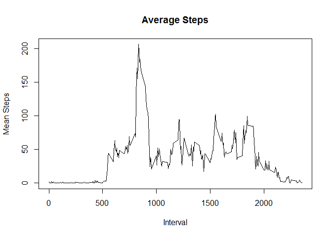
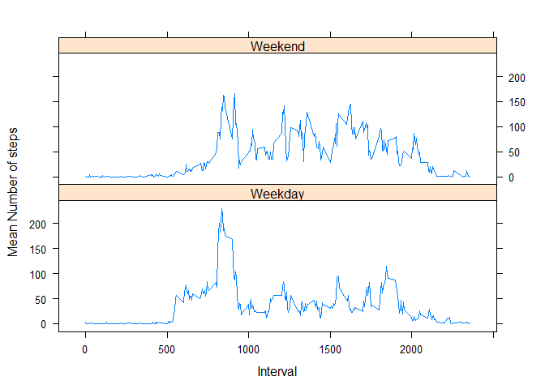

# Reproducible Research: Peer Assessment 1


## Loading and preprocessing the data

Download the data we and insert it into a variable

```r
#Load libraries we will need later
library(ggplot2)
library(plyr)
library(lattice)
#Download the file
#Parts  can be commented out if the file already exists 
file.url <- "http://d396qusza40orc.cloudfront.net/repdata%2Fdata%2Factivity.zip"
file.dest <- "./data/repdata_data_activity.zip"
file.dataset <- "./data/activity.csv"
#Check if data directory exists
if(!dir.exists("./data")) 
{
        dir.create("data", showWarnings = TRUE)
}
# download from the URL
download.file(file.url, file.dest)
# Unzipping file into folder "Data" in wd
unzip(file.dest, exdir="./data")
#read the csv file
repdata <- read.csv(file=file.dataset, header=TRUE, sep=",",na.strings = "NA"  )
```
## What is mean total number of steps taken per day?

First off calculate the total number of steps taken per day

```r
#Build Total steps
totalsteps <- aggregate(repdata[, 'steps'], by=list(repdata$date), FUN=sum, na.rm=TRUE)
totalsteps <- rename(totalsteps, c("Group.1"="Year", "x"="Steps"))
```
Next make a histogram of the total number of steps taken each day  

```r
#Plot thei histogram
qplot(totalsteps$Steps, 
      geom="histogram",
      binwidth = 5000,  
      main = "Histogram for Steps", 
      xlab = "Number of Steps",  
      fill=I("green"), 
      col=I("red"),
      xlim=c(0,30000)
        )
```

 
  
Calculate and report the mean and median of the total number of steps taken per day

The mean number of steps per day is as follows

```r
#Calculate the mean
mean(totalsteps$Steps)
```

```
## [1] 9354.23
```
The median number of steps per day is as follows

```r
#Calculate the median
median(totalsteps$Steps)
```

```
## [1] 10395
```
## What is the average daily activity pattern?
Make a time series plot (i.e. type = "l") of the 5-minute interval (x-axis) and the average number of steps taken, averaged across all days (y-axis)

First caculate the mean number of steps per interval

```r
#Calculate the mean
average <- aggregate(repdata[, 'steps'], by=list(repdata$interval), FUN=mean, na.rm=TRUE)
average <- rename(average, c("Group.1"="interval", "x"="Steps"))
```
The following is a time serise plot that shows the average number of steps per day

```r
#Complete a time serise plot
xrange <- c(0, 2355)
yrange <- range(average$Steps) 

plot(average, type="l", 
     xlab="Interval",
     ylab="Mean Steps")
lines(average$interval, average$Steps)
title("Average Steps")
```

 

Which 5-minute interval, on average across all the days in the dataset, contains the maximum number of steps?

```r
maxvalue <- max(average$Steps, na.rm = FALSE)
average[average$Steps==maxvalue,]
```

```
##     interval    Steps
## 104      835 206.1698
```

## Imputing missing values
Note that there are a number of days/intervals where there are missing values (coded as NA). The presence of missing days may introduce bias into some calculations or summaries of the data.

Calculate and report the total number of missing values in the dataset (i.e. the total number of rows with NAs)

```r
#NUmber of NA#s
sum(is.na(repdata$steps))
```

```
## [1] 2304
```

Devise a strategy for filling in all of the missing values in the dataset. The strategy does not need to be sophisticated. For example, you could use the mean/median for that day, or the mean for that 5-minute interval, etc.

The Strategy i am going to use subsituting in average values for an interval where there is an NA value. A better strategy would have been to use a regression model, however i have used thethe strategy detailed above for speeds sake.

```r
Merged <- merge(repdata, average, by="interval")
Merged$CleansedSteps <-NA
Merged$CleansedSteps <- ifelse(is.na(Merged$steps) == TRUE, Merged$Steps, Merged$steps) 
```
Create a new dataset that is equal to the original dataset but with the missing data filled in.

```r
FinalMerge <- Merged[ ,c("interval", "CleansedSteps", "date")]
FinalMerge <- rename(FinalMerge, c("CleansedSteps"="steps"))
```
Make a histogram of the total number of steps taken each day and Calculate and report the mean and median total number of steps taken per day. Do these values differ from the estimates from the first part of the assignment? What is the impact of imputing missing data on the estimates of the total daily number of steps?


```r
FinalTotSteps <- aggregate(FinalMerge[, 'steps'], by=list(FinalMerge$date), FUN=sum, na.rm=TRUE)
FinalTotSteps <- rename(FinalTotSteps, c("Group.1"="Year", "x"="steps"))

qplot(FinalTotSteps$steps, 
      geom="histogram",
      binwidth = 5000,  
      main = "Histogram for Steps", 
      xlab = "Number of Steps",  
      fill=I("green"), 
      col=I("red"),
      xlim=c(0,30000)
)
```

 

The mean number of steps per day for the cleansed data is as follows

```r
mean(FinalTotSteps$steps)
```

```
## [1] 10766.19
```
The differance in the mean for hte cleansed and non cleasned data set is 

```r
mean(FinalTotSteps$steps) - mean(totalsteps$Steps)
```

```
## [1] 1411.959
```
The median number of steps per day for the cleansed data is as follows

```r
median(FinalTotSteps$steps)
```

```
## [1] 10766.19
```
The differance between the medians is as follows

```r
median(FinalTotSteps$steps) - median(totalsteps$Steps)
```

```
## [1] 371.1887
```
From this we can see there has been an increase in teh mean and median number of steps, we can infer the total number of daily steps has gone up.
## Are there differences in activity patterns between weekdays and weekends?
For this part of the evaluation i am going to use the cleansed dataset

Create a new factor variable in the dataset with two levels - "weekday" and "weekend" indicating whether a given date is a weekday or weekend day.

```r
WeekDay <- FinalMerge 
WeekDay$DayName <- NA 
WeekDay$DayName <- weekdays(as.Date(WeekDay$date))
WeekDay$WeekDayFactor <- ifelse(WeekDay$DayName %in% c("Sunday", "Saturday"), "Weekend", "Weekday") 
```
Make a panel plot containing a time series plot (i.e. type = "l") of the 5-minute interval (x-axis) and the average number of steps taken, averaged across all weekday days or weekend days (y-axis).

```r
TimePlot <- aggregate(WeekDay$steps,
                      list(interval = as.numeric(as.character(WeekDay$interval)), 
                      weekdays = WeekDay$WeekDayFactor),  FUN = "mean")
TimePlot <- rename(TimePlot, c("x"="meansteps"))


xyplot(TimePlot$meansteps ~ TimePlot$interval | TimePlot$weekdays, 
       layout = c(1, 2), type = "l", 
       xlab = "Interval", ylab = "Mean Number of steps")
```

 
